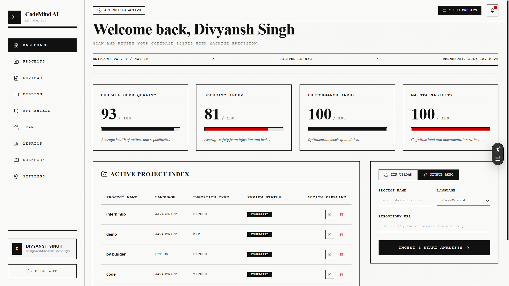
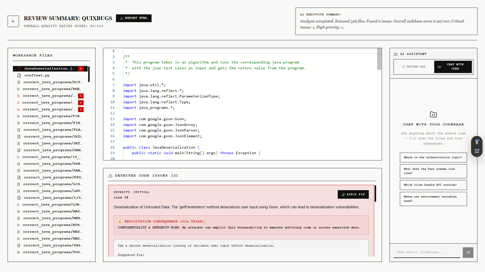
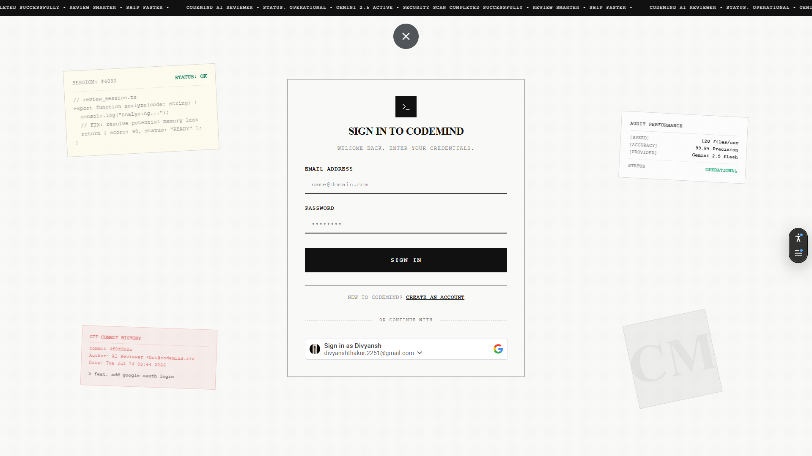
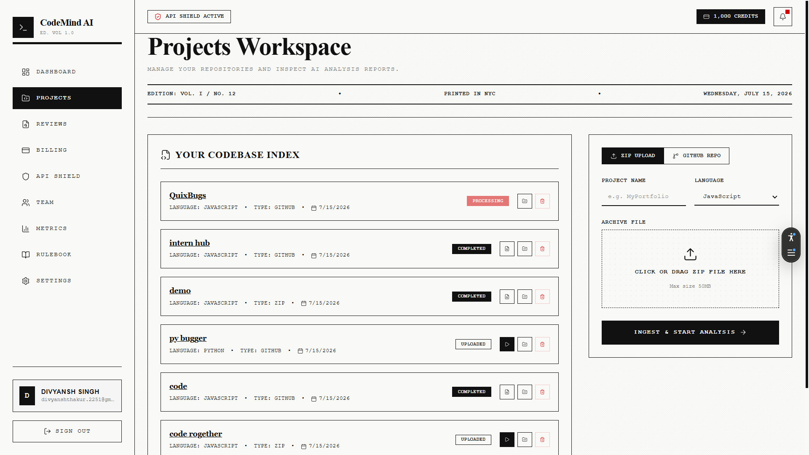
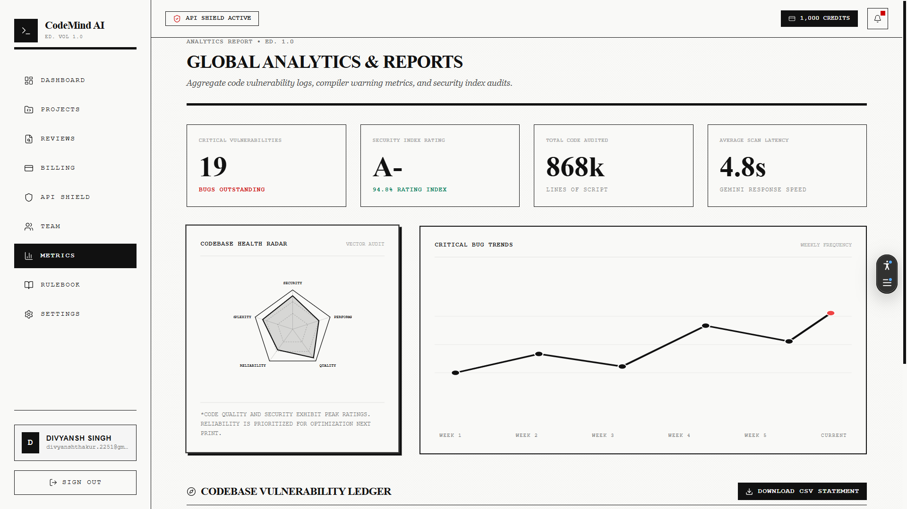
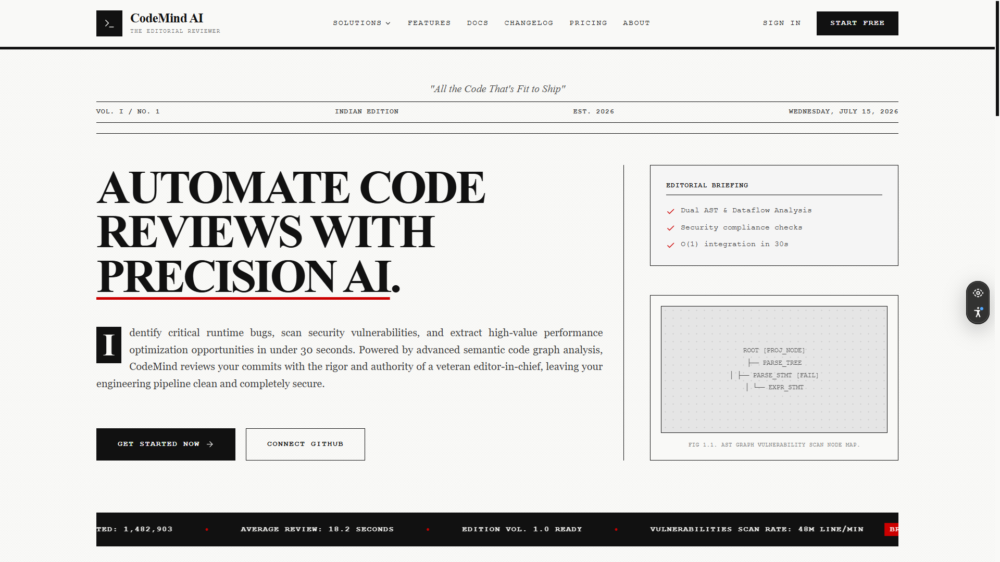

<div align="center">

<!-- Animated Typing Header -->
<a href="https://github.com/">
  
</a>

<br/>

<!-- Animated top wave -->


### 🧠 An industry-standard, AI-driven Code Review platform
Upload a ZIP or import a GitHub repo — get instant bug, security & performance analysis with an interactive AI chat to fix it all.

<br/>

<!-- Badges -->


<br/>


<br/><br/>

[🚀 Live Demo](https://code-mind-ai-code-reviews-and-bug-f.vercel.app/) · [📖 Documentation](./docs/assets/CodeMind Code Audit Report.pdf) · [🐛 Report Bug](#) · [✨ Request Feature](#)

</div>

<br/>

---

## 📌 Table of Contents

- [About The Project](#-about-the-project)
- [Screenshots & Preview](#-screenshots--preview)
- [Key Features](#-key-features)
- [Tech Stack](#️-tech-stack)
- [Architecture](#-architecture)
- [Repository Structure](#-repository-structure)
- [Getting Started](#-getting-started)
- [API Reference](#-api-reference)
- [Roadmap](#️-roadmap)
- [Contributing](#-contributing)
- [License](#-license)
- [Contact](#-contact)

---

## 🎯 About The Project

**AI Code Reviewer** is an automated code review platform that lets developers upload project archives (ZIP) or import GitHub repositories directly to get comprehensive, AI-driven reviews — identifying bugs, security vulnerabilities, and performance bottlenecks — complete with an interactive AI chat to ask questions about code fixes.

> Built for developers who want senior-engineer-level code review, on demand, in seconds.

<br/>

## 🖼️ Screenshots & Preview

<div align="center">

### 🏠 Dashboard


<br/><br/>

### 📊 Review Report


<br/><br/>

<table>
  <tr>
    <td align="center" width="50%">
      <b>💬 AI Chat</b><br/>
      
    </td>
    <td align="center" width="50%">
      <b>🔐 Authentication</b><br/>
      
    </td>
  </tr>
  <tr>
    <td align="center" width="50%">
      <b>📁 GitHub Import</b><br/>
      
    </td>
    <td align="center" width="50%">
      <b>📄 PDF Export</b><br/>
      
    </td>
  </tr>
</table>

<br/>

### 🎬 Landing Page Hero


</div>

> 💡 **Tip:** Drop your screenshots inside `docs/assets/` with the exact filenames above, and they'll render automatically. Add more `<tr>` rows to the table for extra screens.

<br/>

## ✨ Key Features

| | Feature | Description |
|---|---|---|
| 🔐 | **Secure Authentication** | JWT & GitHub OAuth for secure user session management |
| 📦 | **Dual Ingestion** | Upload ZIP archives or clone/parse GitHub repos directly |
| 🧠 | **Deep AI Analysis** | Parses source files, sends smart context to Gemini / GPT-4 |
| 💬 | **Interactive AI Chat** | Ask follow-up questions on specific lines or fixes |
| 📊 | **Beautiful Dashboards** | Next.js + TypeScript UI with scorecards & detailed reports |
| 📤 | **Reports Export** | Downloadable PDF, HTML, and JSON summaries |

<br/>

## 🛠️ Tech Stack

<div align="center">

| Layer | Technology |
|---|---|
| **Frontend** |    |
| **Backend API** |   |
| **AI Service** |   |
| **Database** |  |
| **AI Models** | Gemini Pro · OpenAI GPT-4 |
| **DevOps** |  |

</div>

<br/>

## 🏗️ Architecture

```
┌─────────────┐      ┌──────────────┐      ┌────────────────┐
│  Next.js UI  │ ───▶ │ Express API  │ ───▶ │ FastAPI Worker │
│  (Frontend)  │ ◀─── │  (Gateway)   │ ◀─── │  (AI Analysis) │
└─────────────┘      └──────────────┘      └────────────────┘
                             │                      │
                             ▼                      ▼
                      ┌──────────────┐      ┌────────────────┐
                      │  MongoDB     │      │ Gemini / GPT-4 │
                      │  Atlas       │      │      API       │
                      └──────────────┘      └────────────────┘
```

Full breakdown available in [`docs/06-System-Architecture.md`](./docs/06-System-Architecture.md).

<br/>

## 📁 Repository Structure

<details>
<summary><b>Click to expand full directory layout</b></summary>

```text
ai-code-reviewer/
│
├── client/                         # Next.js Frontend
│   ├── app/                        # Pages & Routes
│   ├── components/                 # Reusable UI Components
│   ├── hooks/                      # Custom React hooks
│   ├── services/                   # Frontend API wrappers
│   ├── lib/                        # Client helper libraries
│   ├── types/                      # TypeScript declarations
│   └── public/                     # Static assets & images
│
├── server/                         # Express.js Backend API
│   ├── src/
│   │   ├── config/                 # Configurations (DB, Cloudinary, Env)
│   │   ├── models/                 # Mongoose schema models
│   │   ├── controllers/            # Request handlers (auth, project, review)
│   │   ├── routes/                 # API endpoint routing
│   │   ├── middlewares/            # Auth guards, upload, error handlers
│   │   ├── services/                # Integrations (AI, GitHub, Reports)
│   │   └── utils/                  # Logger, custom error classes, helpers
│   ├── app.js
│   └── server.js
│
├── ai-service/                     # Python FastAPI AI Worker
│   ├── main.py
│   ├── analyzer.py
│   ├── prompts.py
│   ├── parser.py
│   └── requirements.txt
│
├── docs/                           # Project Specs & API Docs
│   ├── assets/                     # 🖼️ Screenshots & GIFs go here
│   ├── system-design.md
│   ├── openapi.yaml
│   └── postman_collection.json
│
├── docker-compose.yml
└── README.md
```

</details>

<br/>

## ⚡ Getting Started

### Prerequisites
```bash
node >= 18.x
python >= 3.10
MongoDB Atlas URI
```

### Installation

```bash
# 1. Clone the repo
git clone https://github.com/your-username/ai-code-reviewer.git
cd ai-code-reviewer

# 2. Install frontend dependencies
cd client && npm install

# 3. Install backend dependencies
cd ../server && npm install

# 4. Install AI service dependencies
cd ../ai-service && pip install -r requirements.txt

# 5. Set up environment variables
cp .env.example .env

# 6. Run with Docker (recommended)
docker-compose up --build
```

### Environment Variables

```env
MONGODB_URI=
JWT_SECRET=
GITHUB_CLIENT_ID=
GITHUB_CLIENT_SECRET=
GEMINI_API_KEY=
OPENAI_API_KEY=
```

<br/>

## 📚 API Reference

Full OpenAPI v3 spec available at [`docs/openapi.yaml`](./docs/openapi.yaml) — importable Postman collection at [`docs/postman_collection.json`](./docs/postman_collection.json).

| Method | Endpoint | Description |
|---|---|---|
| `POST` | `/api/auth/register` | Create a new user |
| `POST` | `/api/auth/login` | Authenticate user |
| `POST` | `/api/projects/upload` | Upload ZIP project |
| `POST` | `/api/projects/github` | Import GitHub repo |
| `GET` | `/api/reviews/:id` | Fetch review report |
| `POST` | `/api/chat/:reviewId` | Ask AI about a review |

<br/>

## 🗺️ Roadmap

- [x] JWT + GitHub OAuth
- [x] ZIP & GitHub repo ingestion
- [x] AI-powered analysis engine
- [x] PDF/HTML/JSON report export
- [ ] VS Code extension
- [ ] Real-time collaborative reviews
- [ ] Support for GitLab & Bitbucket
- [ ] Self-hosted LLM option

See [`docs/09-Project-Roadmap.md`](./docs/09-Project-Roadmap.md) for the full Gantt schedule.

<br/>

## 🤝 Contributing

Contributions make the open-source community amazing. Any contributions are **greatly appreciated**.

1. Fork the project
2. Create your feature branch (`git checkout -b feature/AmazingFeature`)
3. Commit your changes (`git commit -m 'Add some AmazingFeature'`)
4. Push to the branch (`git push origin feature/AmazingFeature`)
5. Open a Pull Request

<br/>

## 📄 License

Distributed under the **MIT License**. See `LICENSE` for more information.

<br/>

## 📬 Contact

<div align="center">

Made with ❤️ and lots of ☕

[](#)
[](#)
[](#)

<br/>


</div>
