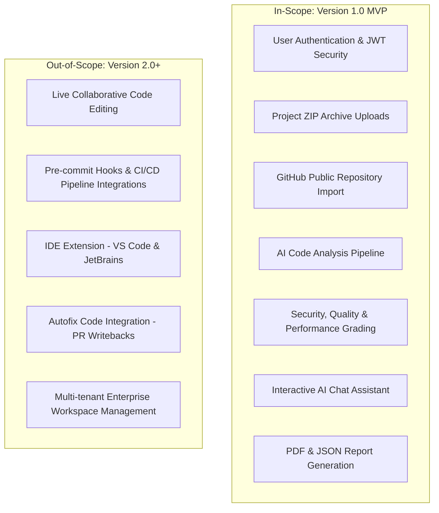

# 01. Project Overview: CodeMind AI

## 1. Project Metadata
*   **Project Name**: CodeMind AI
*   **Tagline**: Review Smarter. Ship Faster.
*   **Document Version**: 1.0.0
*   **SDLC Phase**: Phase 1 – Project Planning

---

## 2. Project Executive Summary
**CodeMind AI** is an enterprise-grade, AI-powered static code analysis and review platform. It is engineered to help software developers, bootcamps, and agile teams automate standard code review processes. By analyzing codebase artifacts for syntax errors, logical bugs, security vulnerabilities (OWASP Top 10), and performance bottlenecks, CodeMind AI shifts quality assurance left, enabling faster deployment cycles and cleaner codebases.

---

## 3. Problem Statement
In modern software engineering, manual code reviews represent a significant bottleneck. Developer hours are spent on repetitive syntax checking, style formatting, and finding common security oversights. 
*   **Resource Depletion**: Senior developers spend up to 25-30% of their weekly capacity conducting code reviews.
*   **Human Error**: Under tight sprint deadlines, critical logical and security vulnerabilities are often missed.
*   **Lack of Access**: Freelancers, students, and early-stage startup teams lack the resources to hire dedicated QA engineers or senior reviewers.

---

## 4. Objectives
*   **Automate Defect Detection**: Automate code analysis to identify syntax bugs, logic flaws, and architectural anti-patterns instantly.
*   **Optimize Developer Velocity**: Reduce the average turnaround time for standard PR reviews by 70%.
*   **Enhance Code Security**: Integrate automated scans that flag vulnerabilities like SQL injection, XSS, and hardcoded secrets.
*   **Developer Onboarding & Learning**: Provide contextual explanations and direct refactoring/fix recommendations to act as an educational co-pilot.

---

## 5. Target Stakeholders & User Persona

### Primary Users
1.  **Software Developers (Junior & Mid-Level)**: Seek quick verification of their code sanity, style alignment, and vulnerability prevention.
2.  **Freelancers**: Require a virtual secondary reviewer to ensure high-quality delivery without overhead costs.
3.  **Computer Science Students & Bootcamp Learners**: Use the platform to understand structural mistakes and refactoring patterns.

### Secondary Users
1.  **Engineering Managers / Team Leads**: Need visibility into the repository's health index and code standards consistency.
2.  **QA Engineers**: Wish to automate pre-review checks so they can focus on system-wide integration and E2E testing.

---

## 6. Project Scope

---

## 7. Key Performance Indicators (KPIs)
*   **Review Turnaround Time**: Generation of comprehensive review reports under **30 seconds** for standard codebase uploads (<50MB).
*   **AI Quality Index**: Maintain an **85%+** rating of useful, context-accurate AI review recommendations with zero hallucinations.
*   **Vulnerability Detection**: Achieve a **95% recall rate** on common vulnerability patterns (e.g., hardcoded credentials, cleartext passwords).
*   **System Reliability**: Target **99.9% uptime** for backend services and AI review processors.

---

## 8. Assumptions & Constraints

### Assumptions
*   Users upload readable, complete, and compile-ready source code contexts.
*   Public API Gateways (OpenAI API / Google Gemini API) are fully operational and maintain high throughput.
*   GitHub OAuth integration remains stable and does not change token structures.

### Constraints
*   **Payload Limit**: Maximum upload size is restricted to **50 MB** per ZIP file.
*   **API Rate Limits**: Requests are subject to AI model token limits and daily query allocations.
*   **Repository Depth**: Large repositories with deep nested folders may be throttled or queued for asynchronous processing.
