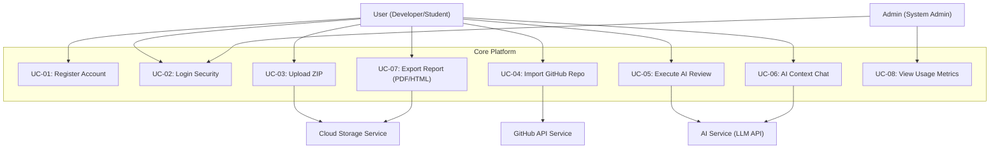
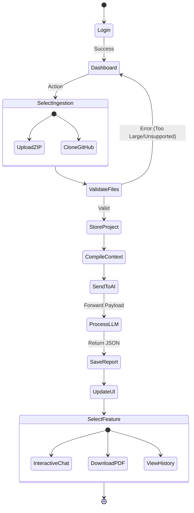
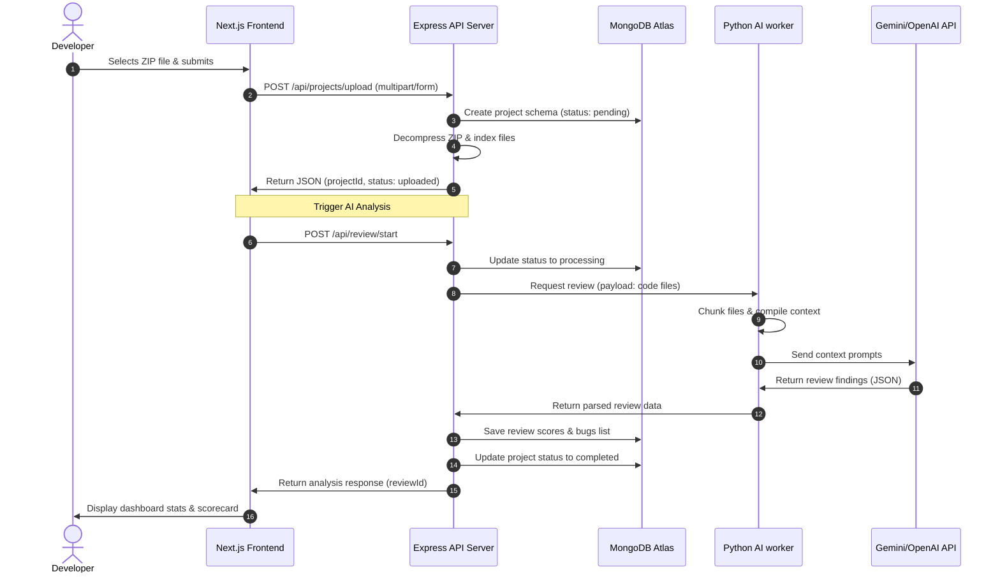
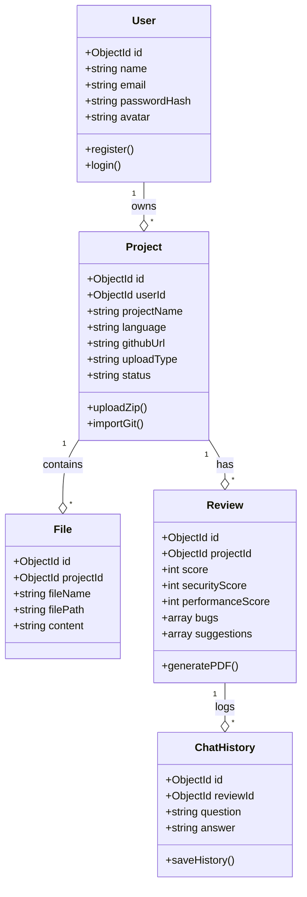
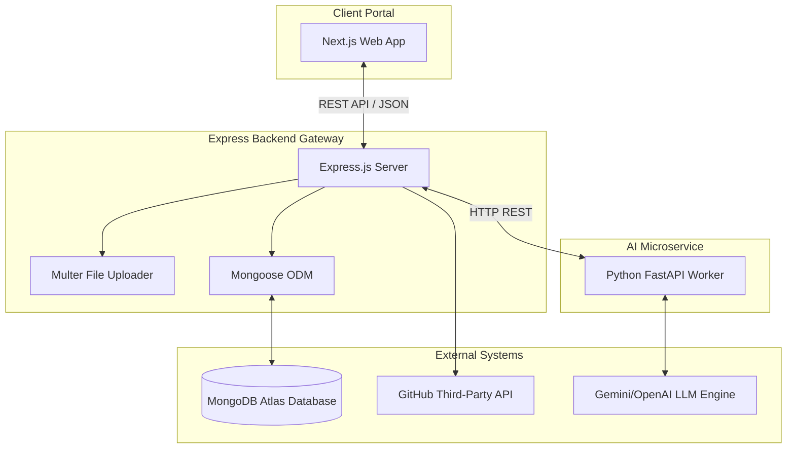
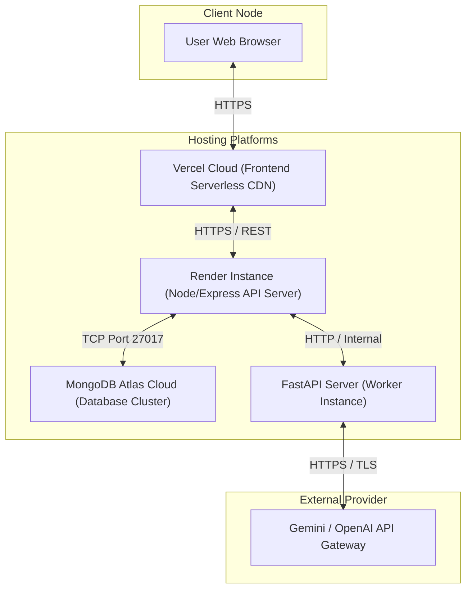
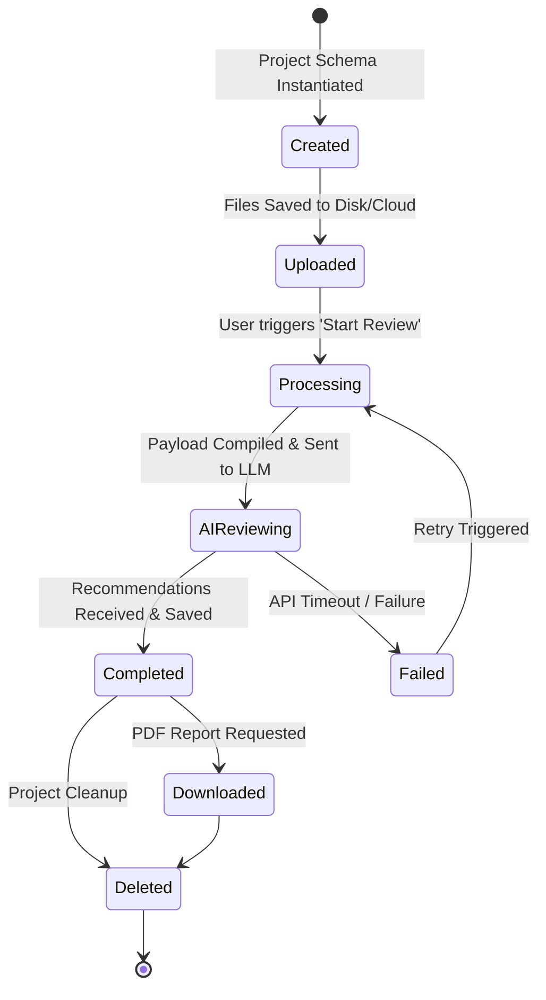

# 05. UML & System Modeling

This document details the UML modeling, actor definitions, sequence flows, class layouts, and architectural deployment mappings for **CodeMind AI**.

---

## 1. Actor Identification
The platform defines five operational actors/systems interacting with its business boundary:

*   **User (Primary - Developer/Student)**: Uploads codebases, starts reviews, reads reports, chats with the AI, and configures their profile.
*   **Admin (Primary - Administrator)**: Oversees system operations, views platform usage metrics, and manages active users.
*   **AI Service (Secondary System)**: Third-party LLM engine (OpenAI GPT / Gemini) performing code scanning.
*   **GitHub API (Secondary System)**: Fetches repository source files.
*   **Cloud Storage (Secondary System)**: Hosts raw uploaded project ZIP archives and exported PDF reports.

---

## 2. Use Case Model
The relationships between actors and functional modules are illustrated below:

---

## 3. Main Use Cases Specifications

### UC-01: Register
*   **Actor**: User
*   **Precondition**: User is anonymous.
*   **Success Flow**:
    1. User navigates to the Registration page.
    2. User submits name, email, and password.
    3. System validates constraints and hashes the password.
    4. Account is successfully persisted in the database.

---

### UC-02: Login
*   **Actor**: User / Admin
*   **Precondition**: User has a registered account.
*   **Success Flow**:
    1. User enters email and password credentials.
    2. System verifies credentials against stored hash values.
    3. System signs and generates a JWT payload.
    4. User is redirected to their Dashboard.

---

### UC-03: Upload Project
*   **Actor**: User
*   **Precondition**: User has an active JWT session.
*   **Success Flow**:
    1. User selects a local `.zip` project archive.
    2. System verifies file type and enforces the 50MB limit.
    3. System stores file inside Cloud Storage and indexes files.
    4. System queues the review process.

---

### UC-04: Import GitHub Repository
*   **Actor**: User
*   **Precondition**: User has an active session.
*   **Success Flow**:
    1. User provides a GitHub Repository URL.
    2. Backend clones the public repo (or uses OAuth tokens for private ones).
    3. Backend parses directory and creates file indexes.
    4. System initiates the code review pipeline.

---

### UC-05: AI Review Execution
*   **Actor**: AI Service Engine
*   **Precondition**: Project metadata and files are stored.
*   **Success Flow**:
    1. System compiles codebase files and splits them into token-valid chunks.
    2. Payload is sent to the LLM API.
    3. System receives recommendations for bugs, security, and performance.
    4. System saves the final review metrics and updates the database.

---

### UC-06: AI Chat Interaction
*   **Actor**: User / AI Service
*   **Precondition**: Target review is completed.
*   **Success Flow**:
    1. User opens the chat pane under a completed review file.
    2. User enters a query (e.g., "Explain this performance issue").
    3. System passes context history + question to the LLM.
    4. System returns the explanation and logs history.

---

## 4. Activity Diagram

---

## 5. Sequence Diagram

---

## 6. Class Diagram

---

## 7. Component Diagram

---

## 8. Deployment Diagram

---

## 9. State Diagram (Review Lifecycle)

