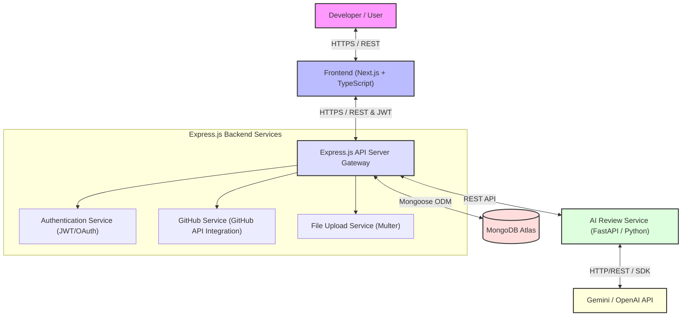
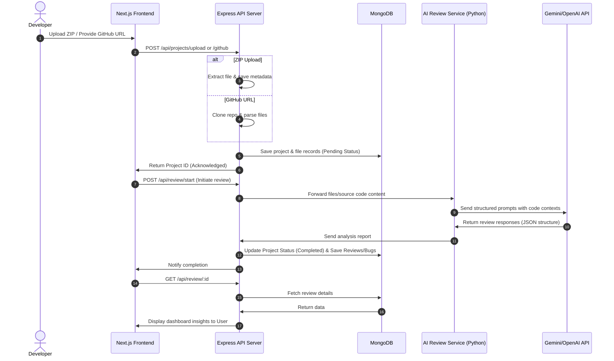

# 06. System Architecture

This document describes the design patterns, component relationships, and microservices interaction model of the CodeMind AI system.

---

## 1. High-Level Architectural Layout

CodeMind AI follows a service-oriented architectural model separating frontend execution, application routing, and heavy LLM/AI computations into dedicated layers:

---

## 2. Component Directory & Responsibilities

### 2.1 Next.js Frontend (`client/`)
*   **Role**: Client-side UI & Routing.
*   **Technologies**: Next.js (App Router), React, TypeScript.
*   **Responsibilities**: 
    *   Secure token management (JWT storage).
    *   Dynamic code analysis dashboard and code preview panel.
    *   Interactive chat interface using optimistic rendering.
    *   Responsive layouts using CSS Variables and responsive breakpoints.

### 2.2 Express Backend (`server/`)
*   **Role**: Application Gateway, API Routing, Data Orchestrator.
*   **Technologies**: Node.js, Express.js, Mongoose.
*   **Responsibilities**:
    *   User Session Management and authentication checks.
    *   File Upload Ingestion (Multer middleware) & extraction.
    *   GitHub public repository cloning and file structure preparation.
    *   Interaction logic with Python AI engine.
    *   Report construction and formatting.

### 2.3 AI Review Service (`ai-service/`)
*   **Role**: High-efficiency Analysis Engine.
*   **Technologies**: Python, FastAPI.
*   **Responsibilities**:
    *   Abstract Syntax Tree (AST) parsing for supported languages.
    *   Token context compiler (combining related files to manage LLM prompt size).
    *   Interfacing with Gemini/OpenAI API.
    *   Output validating and structural formatting of AI JSON returns.

---

## 3. Data Flow Orchestration

