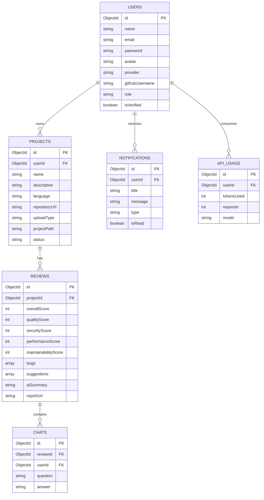

# 07. Database Design (MongoDB & Mongoose)

This document outlines the schema validation rules, collection structures, indexing strategies, relationships, and data flow modeling for the **CodeMind AI** database layer.

---

## 1. Database Architecture & Naming
*   **Database Name**: `codemind_ai`
*   **Database Technology**: MongoDB Atlas (Multi-cloud cluster)
*   **ODM Layer**: Mongoose (for Node.js schema validation and relational models)

---

## 2. Collection Schemas & Validations

### 2.1 Users Collection (`users`)
Stores registered accounts, user profiles, credentials, and authentication provider status.

```typescript
const UserSchema = new Schema({
  name: { type: String, required: true, trim: true },
  email: { 
    type: String, 
    required: true, 
    unique: true, 
    index: true,
    lowercase: true,
    trim: true,
    match: [/^\w+([\.-]?\w+)*@\w+([\.-]?\w+)*(\.\w{2,3})+$/, 'Please fill a valid email address']
  },
  password: { 
    type: String, 
    required: function() { return this.provider === 'local'; },
    minlength: 8 
  },
  avatar: { type: String, default: "" },
  provider: { type: String, enum: ["local", "google"], default: "local" },
  githubUsername: { type: String, default: "", index: true },
  role: { type: String, enum: ["user", "admin"], default: "user" },
  isVerified: { type: Boolean, default: false },
  createdAt: { type: Date, default: Date.now },
  updatedAt: { type: Date, default: Date.now }
});
```

---

### 2.2 Projects Collection (`projects`)
Logs metadata for repositories and archives imported or uploaded by users.

```typescript
const ProjectSchema = new Schema({
  userId: { type: Schema.Types.ObjectId, ref: "User", required: true, index: true },
  name: { type: String, required: true, maxlength: 100, trim: true },
  description: { type: String, default: "" },
  language: { type: String, required: true },
  repositoryUrl: { 
    type: String, 
    validate: {
      validator: function(v) {
        if (this.uploadType === 'github') {
          return /^(https:\/\/github\.com\/[a-zA-Z0-9-]+\/[a-zA-Z0-9-_\.]+)$/.test(v);
        }
        return true;
      },
      message: 'Invalid GitHub URL'
    }
  },
  uploadType: { type: String, enum: ["zip", "github"], required: true },
  projectPath: { type: String, required: true }, // Points to storage file key/path
  status: { 
    type: String, 
    enum: ["uploaded", "processing", "completed"], 
    default: "uploaded",
    index: true
  },
  createdAt: { type: Date, default: Date.now },
  updatedAt: { type: Date, default: Date.now }
});
```

---

### 2.3 Reviews Collection (`reviews`)
Maintains the detailed report outputs, metrics, and quality ratings returned by the AI.

```typescript
const ReviewSchema = new Schema({
  projectId: { type: Schema.Types.ObjectId, ref: "Project", required: true, index: true },
  overallScore: { type: Number, min: 0, max: 100, required: true },
  qualityScore: { type: Number, min: 0, max: 100, required: true },
  securityScore: { type: Number, min: 0, max: 100, required: true },
  performanceScore: { type: Number, min: 0, max: 100, required: true },
  maintainabilityScore: { type: Number, min: 0, max: 100, required: true },
  bugs: [{
    filePath: { type: String, required: true },
    line: { type: Number, required: true },
    severity: { type: String, enum: ["low", "medium", "high", "critical"], required: true },
    description: { type: String, required: true },
    fixSuggestion: { type: String, required: true }
  }],
  suggestions: [{ type: String }],
  aiSummary: { type: String, required: true },
  reportUrl: { type: String, default: "" }, // Link to PDF file in cloud storage
  createdAt: { type: Date, default: Date.now }
});
```

---

### 2.4 Chats Collection (`chats`)
Logs messages sent during Q&A discussions about specific codebase reviews.

```typescript
const ChatSchema = new Schema({
  reviewId: { type: Schema.Types.ObjectId, ref: "Review", required: true, index: true },
  userId: { type: Schema.Types.ObjectId, ref: "User", required: true },
  question: { type: String, required: true },
  answer: { type: String, required: true },
  createdAt: { type: Date, default: Date.now }
});
```

---

### 2.5 Notifications Collection (`notifications`)
Stores logs of alerts triggered to update users regarding review completions or system messages.

```typescript
const NotificationSchema = new Schema({
  userId: { type: Schema.Types.ObjectId, ref: "User", required: true, index: true },
  title: { type: String, required: true },
  message: { type: String, required: true },
  type: { type: String, enum: ["review", "system", "billing"], default: "review" },
  isRead: { type: Boolean, default: false },
  createdAt: { type: Date, default: Date.now }
});
```

---

### 2.6 ApiUsage Collection (`apiusages`)
Monitors the count and token usage of AI prompts to evaluate operational cost allocations.

```typescript
const ApiUsageSchema = new Schema({
  userId: { type: Schema.Types.ObjectId, ref: "User", required: true, index: true },
  tokensUsed: { type: Number, required: true, min: 0 },
  requests: { type: Number, default: 1 },
  model: { type: String, required: true }, // e.g., gemini-1.5-flash, gpt-4o
  createdAt: { type: Date, default: Date.now, index: true }
});
```

---

## 3. Entity-Relationship (ER) Diagram



---

## 4. Indexing & Optimization Strategy

To ensure queries resolve efficiently under high user volumes, the following indexes must be configured in Mongoose schema configurations:

| Collection | Target Field | Index Type | Purpose |
| :--- | :--- | :--- | :--- |
| **users** | `email` | Unique Single Field | Forces account uniqueness; optimizes login queries. |
| **users** | `githubUsername` | Single Field | Speeds up lookups during OAuth callback redirects. |
| **projects** | `userId`, `status` | Compound Index | Optimizes dashboard loading filters for active user projects. |
| **reviews** | `projectId` | Single Field | Speeds up details loading on the dashboard review tab. |
| **chats** | `reviewId` | Single Field | Speeds up historical message thread loads. |
| **notifications**| `userId` | Single Field | Optimizes notifications badge polling. |
| **apiusages** | `userId`, `createdAt` | Compound Index | Speeds up daily/monthly token calculations. |

---

## 5. Architectural Decision: Why No `Files` Collection?

CodeMind AI processes raw user code repositories but chooses **not to store raw code files inside MongoDB collections**.

1.  **Storage Efficiency (GridFS Alternatives)**: Storing multi-line source strings of thousands of files raises the database size and memory footprint rapidly, causing slow collection scans.
2.  **Performance Constraints**: MongoDB documents are subject to a **16 MB BSON size limit**. Entire repositories easily exceed this restriction if compressed as a single document.
3.  **Cost Optimization**: File systems or Object Storage (such as Amazon S3 or Cloudinary) are 80-90% cheaper per gigabyte than active MongoDB cluster storage.

**The Hybrid Approach**:
*   The raw code archive (ZIP) is uploaded to transient local folder storage or secure S3 objects.
*   The AI review service reads code directly from files, processes tokens, and returns analysis metadata.
*   Only structural feedback, score summaries, and bug details are written into the `reviews` collection. Code structures are deleted post-analysis.
