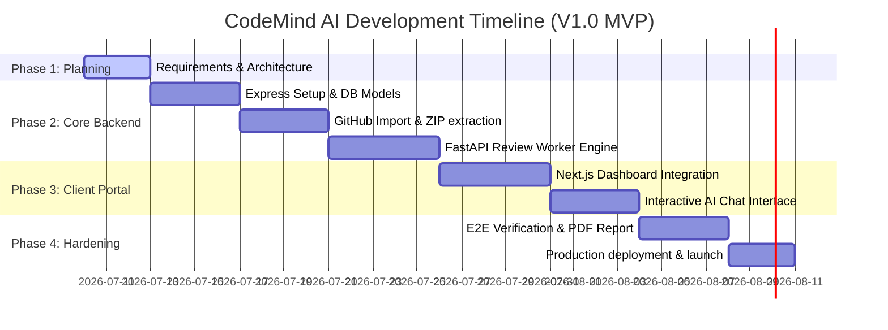

# 09. Project Roadmap & Milestones

This document details the development lifecycle, phases, tasks distribution, and release milestones for CodeMind AI.

---

## 1. Project Phases & Milestones

The project is structured into 4 sequential sprints based on a 4-week delivery plan:

---

## 2. Milestone Details

### Milestone 1: Requirements Signed-off (M1)
*   **Target Date**: Day 3
*   **Deliverables**: Functional Specification, DB Design, OpenAPI standard definition.

### Milestone 2: Backend API & AI Core Functional (M2)
*   **Target Date**: Day 16
*   **Deliverables**: 
    *   Operational Express API server matching paths.
    *   Successful ZIP parsing and repository cloning mechanism.
    *   Python FastAPI service successfully completing LLM context exchanges.

### Milestone 3: Client Dashboard Integrated (M3)
*   **Target Date**: Day 25
*   **Deliverables**: Next.js client connected to the backend APIs, dashboard charts displaying scores, line-by-line annotations, and real-time chat.

### Milestone 4: Product Launch (M4)
*   **Target Date**: Day 32
*   **Deliverables**: Live platform on cloud services (e.g. Render/Vercel/MongoDB Atlas), bug-free report exports.
